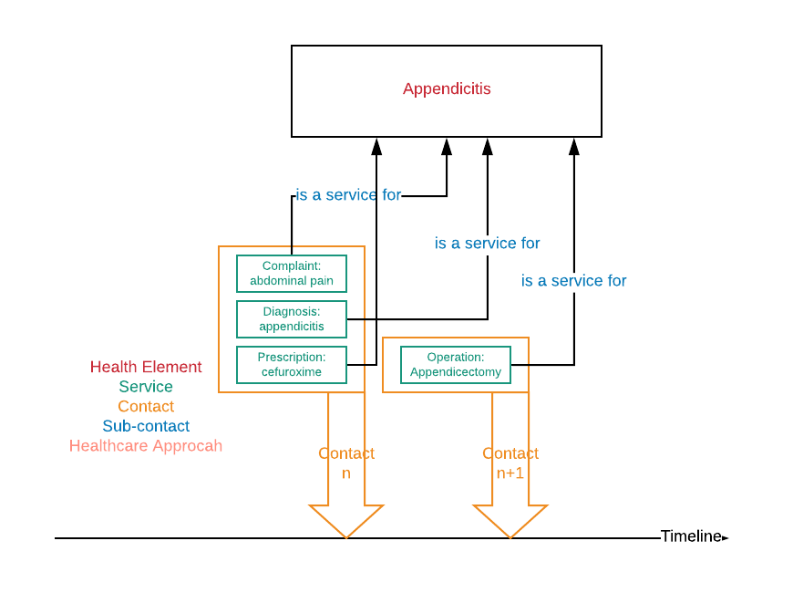

# Overview

Designing a data model is always the result of a trade off. The iCure data model has been designed with several technical goals in mind:

* Ensuring the data model is extensible
* Guaranteed efficiency in resolving conflicts in the data-store
* Allowing selective encryption of the medical data
* An efficient storage strategy in document/object databases

The iCure data model is split into two categories of entities&#x20;

* Actors: They provide, create, access and modify the medical data. They are either Healthcare parties (HCPs) or Patients.
* Medical data: The medical information that has been collected in iCure. This data is organized as a journal inside entities called contacts. Extra entities are used to structure the medical information.

### Actors

An Actor is a _patient_ or a _healthcare party_. When an actor has been given access to the EHR, a _user_ entity is created to store Authentication/Authorization data. An actor without an associated _user _has no access to iCure, whereas, an actor that has been connected to a _user_ is able to read, add or modify data in the limits of the access rights that have been assigned to it.&#x20;

#### Patient

The patient is the recipient of care. Nearly all medical information inside iCure is linked directly or indirectly to a patient. The _patient_ entity is usually created during the first contact of a patient with a healthcare party. The administrative information of the patient can be partially or totally encrypted before being saved inside the _patient_ entity.

#### Healthcare party

A healthcare party is someone who is recognized to provide care or services for a patient. A healthcare party is either an individual healthcare professional (a doctor, a nurse, a physiotherapist, etc.) or an organization (a clinic, a hospital, a government authority, etc.). A healthcare party includes anyone who is a stakeholder for the patient health and can access and manage the patient's file.

### Medical data

In the following section, the chronological entities and different structural elements of a patient's file is described in detail.

#### Contact

Every time a patient consults a healthcare party or every time a healthcare party accesses a patient's medical file, the actions performed are recorded and collected inside a _contact_. The _contact_ is the entity that records the medical information about the _patient_ chronologically. A visit to the patient's house, a consultation at the practice, a phone call between the patient and the HCP or integrating lab reports into the medical file are examples of when a _contact _can be recorded.

A contact can occur with or without direct interaction between the patient and the HCP. For example, when a healthcare party encodes data received from laboratory's test result, this is done in the absence of a patient.

A _contact _groups together pieces of information collected during one single event, for one single patient and for one or more healthcare parties. Patient's complaints, the diagnosis of a new problem, a surgical procedure, etc. are collected inside a contact.&#x20;

The main sub-element of the contact is the _service_. Each atomic piece of information collected during a contact is a _service_ and is stored inside the _services_ list of a _contact_.&#x20;

#### Service

_Services_ include subjective information provided by the patient, such as complaints, reason for visit, feelings, etc. or objective information like bio-metric measures (blood pressure, temperature, heart beat, etc.), or physical exam description, diagnosis, prescription, integration of lab reports from another healthcare party, action plan, etc.&#x20;

Any action performed by the healthcare party which is relevant for the healthcare element of a patient is considered a _service_.&#x20;

Because _contacts_ are purely chronological objects, they do not convey information about the organization of the medical file. They however, do include a data structure to link _services _to existing structuring elements such as _healthcare elements_, _healthcare approaches_ and _forms_. This data structure is the _sub-contacts_ list.

**Sub-contact**

A sub-contact is an object embedded inside a contact that links one or several _services_ to one _healthcare element_, _healthcare approach_ or _form_.

#### Healthcare element

_Healthcare element_ can be described as the reason for the patient to consult a healthcare party. The _healthcare element _has a starting moment and optionally an ending moment. In the case of incurable chronic diseases, the ending time is usually the time of death of the patient. The _healthcare element_ usually represents a healthcare problem (diabetes, kidney failure, hypertension, heart attack, etc.) but this is not always the case. Pregnancy, right alignment of the heart, etc. are examples of _healthcare elements_ which do not pose a healthcare problem.

#### Healthcare approach

_The healthcare approach_ is part of a _healthcare element_ and represents an action undertaken for the follow-up of a given _healthcare element_ of a patient. A _healthcare approach_ groups together the services that are meant as solution for the given _healthcare element_.

#### Form

A _form_ collects a series of _services_ in one single visual entity. It is used to organize  the information on screen. It is used to create input forms, dashboards, folders hierarchies or more generally any structure needed by a developer to sort or group the information for an user.

### Example use case

Let's look at the above mentioned elements explained with a fictional patient:

The patient observes a mild pain in the lower right side of the abdominal area on July 1. It is not consistent. On July 2, the pain becomes severe and is now covering the whole abdominal area. The pain is consistent and continuous through out the day. Towards the end of the day, the patient starts vomiting and the pain is unbearable.&#x20;

The patient loses sleep and on 3 July, early morning rushes to the hospital after having vomited multiple times and the pain now being unbearable. This is the n-th contact shown above. The patient complains to the doctor about the symptoms and after thorough examination, the doctor diagnoses him with appendicitis. The doctor recommends a surgical operation of appendectomy the next day. The doctor also prescribes antibiotic cefuroxime, intravenously, to reduce spread of infection in the abdomen.&#x20;


Several events take place before the patient makes the first consultation with the _healthcare party, _these events leading to the _contact (n). _During the _contact_ (n), the physician's software creates a _contact_, the beginning moment of the contact is the moment of the consultation. It also creates a _healthcare element,_ appendicitis (beginning moment: July 1). Three _services_ are created during the course of the consultation: the complaint, the diagnosis and the prescription. These three _services _are saved inside _contact_ (n) and they are connected by means of one _sub-contact_ with three links to the _healthcare element, _appendicitis.


During the next _contact _(n+1) on July 4, the surgical operation of appendectomy, is carried out. After 3 days in observation, the patient is released from the hospital with a prescription of antibiotics for next 6 days and recommends a recovery period of 4 weeks.&#x20;


&#x20;This _contact_ (n+1) is a simple one. It holds only one _service (appendectomy) _connected to one _healthcare element _(appendicitis).


.png>)

Sometime later, the patient is diagnosed with diabetes. The patient develops difficulties due to this. Few consultations were made with the doctors attempting to keep these conditions under control. One of the conditions the patient develops is necrosis in a toe. The doctor recommends amputation of the toe (figure 2). On March 7, the patient is asked to get admitted for the surgical procedures of toe amputation. After proper healing of the wound, on April 7, the patient begins sessions with a physiotherapist to help with walking again.&#x20;


Previous _contacts _have already occurred diagnosing and recording diabetes and necrosis, prior to prescribing a follow-up plan of toe amputation (these are not shown in figure 2). The _contact_ (m) records a _service _of toe amputation operation_ _linked to multiple structuring element, here, the patient's existing _healthcare element_, diabetes and the _healthcare approach_ of toe amputation. The _contact _(m+1) for physiotherapy is only linked to the _healthcare approach_ of toe amputation. Note the _healthcare element, _diabetes,_ _continue to exist.


As a result of diabetic condition, the patient later on, has an episode of heart attack. The patient is prescribed lifestyle changes, medication, cardiac rehabilitation, etc. and asked to consult again in 2 weeks for the follow up of the heart attack episode (not shown in figure 2). During this consultation, various bio-metric measures like, blood sugar level, blood pressure, etc. was recorded. The change in weight was also recorded in order to measure how much life style changes were effective.&#x20;


_Contact _(p)_ _holds service linked to two _healthcare elements,_ one already existing and chronic and the other previously recorded. _Services _provided are follow-up consultation, bio-metric measurements and weight measurement which are linked to either of the _healthcare elements _(diabetes, heart attack). Note here that weight tracking is a _service _for both _healthcare elements. _Here diabetes does not have an ending point and continues along the timeline.

